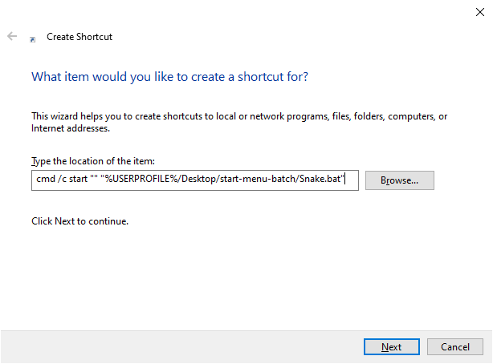
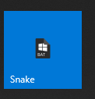

# Start Menu Batch 

Example on how to create a Windows 10 Start Menu entry for a .bat (batch) file.

The example used is a simple batch file to start a VMWare Workstation VM on my machine named "Snake".


## How To

1. After creating a batch (.bat) file, right-click on the Desktop and 
select "New" -> "Shortcut".

    

2. On the "Create Shortcut" dialog prompt, enter the following value, and click the "Next" button:

    ```cmd
    cmd /c start "" "%USERPROFILE%/start-menu-batch/Snake.bat"
    ```

    

    ***Note**: Change `"%USERPROFILE%/start-menu-batch/Snake.bat"` with the path to your batch file.*

3. Enter a name for the shortcut and click the "Finish" button:

    

4. Right-click on the newly created shortcut file, select "Properties", and click on "Change Icon":

    

5. Click the "Browse" button and locate the desired icon (.ico) file:

    

6. Once the desired icon is selected, click the "OK" button twice.

    

7. Right-click the shortcut file again, and select "Pin to Start":

    

8. If desired, right-click on the start menu shorcut and resize it to small:

    

9. Place your start menu shorcut where you would like it: 

    


## Additional Resources

To convert a PNG (.png) image to an ICON (.ico), I recommend:

[CONVERTICO](https://convertico.com/)